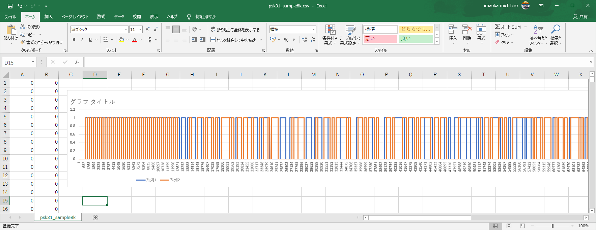

# Demodulation PSK31 in Python

This is a Python program to demodulate the psk31 known as QPSK modulation.
This is the simplest example, and only the Terminal Unit part of the psk31 is implemented. See also https://en.wikipedia.org/wiki/PSK31


## Sample sound file

should be convet to wave format.
The input audio file should have a sampling rate of 8000 Hz and a quantization bit rate of unsigned 8 bits.<p>
https://en.wikipedia.org/wiki/File:PSK31_sample.ogg<p>
it is from wikipedia of psk31. If you decode it, it becomes "Welcome to Wikipedia, the free encyclopedia that anyone can edit."

### Convert ogg file to wave format

Install [ffmpeg](https://www.ffmpeg.org/) and run:

~~~
ffmpeg -i psk31.ogg -ar 8k -c:a pcm_u8 -f wav psk31.wav
~~~

## Parameters
Some parameters in the source code need to be modified according to the audio file to be input.

- signed
pass True if the input audio file is signed.

- frequency
Signal Frequency. This sound example should be 1000.0.
This figure shows the spectral distribution of a sample sound file. There is a peak around 1000Hz.


## Complex Plane and Value Assignment
Modify this line if you want to change the value assignment for the complex plane.
~~~
print(int(sum(q)>0),int(sum(i)>0),sep=",")
~~~

## Usage

### Output per-frame value

Please specify an appropriate audio file for the input.
~~~
 python -m psk31.main psk31.wav
~~~
Demodulation example


### decode string

```
python -m psk31.parser psk31.wav
```

